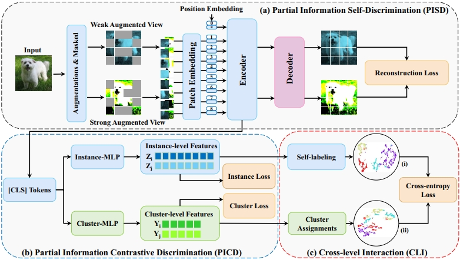

# PICI
Official Implementation of the paper: Learning Clustering-Friendly Representations via Partial Information Discrimination and Cross-Level Interaction.
# News
**Congratulations!!!** Our paper was officially accepted by the journal **NEURAL NETWORKS (CCF B)**

# Proposed Framework


An overview of our PICI framework, which encompasses three partial information learning modules, namely, (a) the PISD module, which enforces the partial information self-discrimination upon the masked images via a Transformer auto-encoder, (b) the PICD module, which takes the class tokens [CLS] as input and performs two levels of contrastive learning, and (c) the CLI module, which enables the mutual interaction between the instance- and cluster-level subspaces by constraining their cross-level consistency.
## Usage
### Configuration
There is a configuration file "config/config.yaml", which can be edited for both the training and test options.
### Training
After setting the configuration, to start training, simply run
```shell
python train_pici.py
```
### Test
After the training phase, there will be a saved model in the "model_path" specified in the configuration file. To validate the trained model, run
```shell
python cluster_pici.py
```
## Citation
```bibtex
@article{zhang2024learning,
  title={Learning Representations for Clustering via Partial Information Discrimination and Cross-Level Interaction},
  author={Zhang, Hai-Xin and Huang, Dong and Ling, Hua-Bao and Zhang, Guang-Yu and Sun, Wei-jun and Wen, Zi-hao},
  journal={arXiv preprint arXiv:2401.13503},
  year={2024}
}
```
